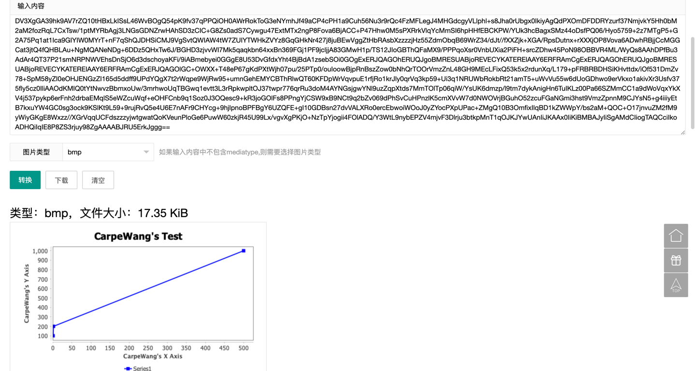

# Chartify
### 介绍
> 这是我今天突发奇想做的一个小项目，目的是把数据可视化处理，后期加上Select 字段 from DB，自动形成可视化图片的工具，目前只有一个固定的写死的demo样式
> 
### 使用
* 1：直接拼接参数发请求
* 2：在单测里面拼写对应的参数，会生成一串字符串，该字符串是基于base64的，网络上找解析器即可。

### 结果，如下图
>iVBORw0KGgoAAAANSUhEUgAAAfQAAAEsCAYAAAA1u0HIAABF ..........

> 后续改成前端生成，不然太僵硬

# 现在还是个demo!!!